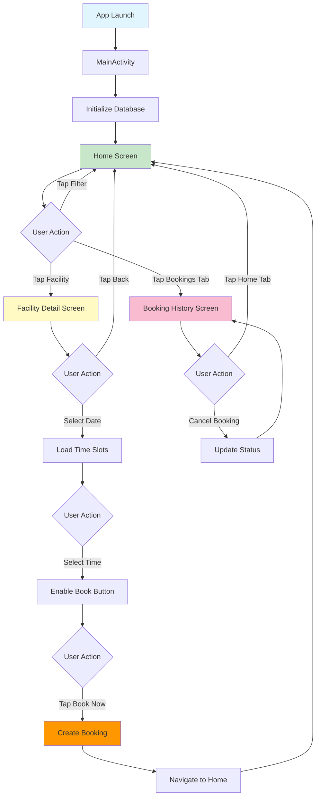
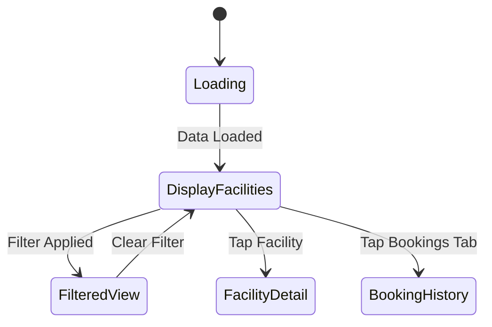
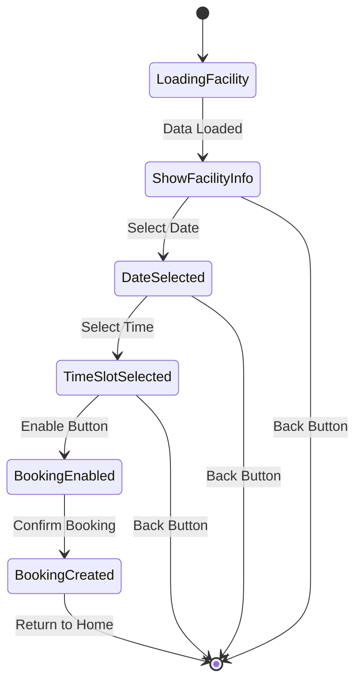
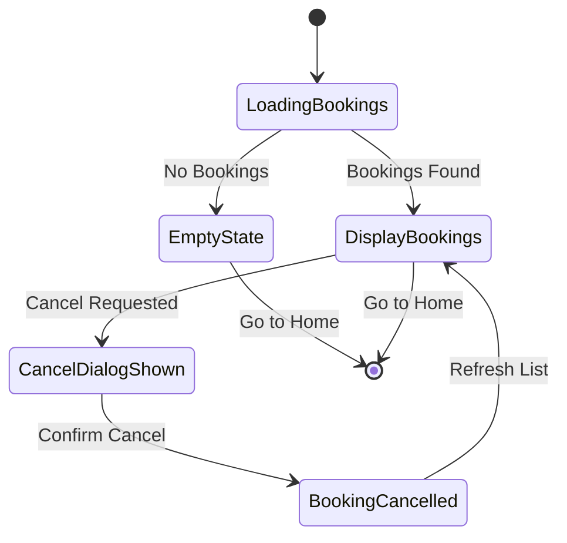
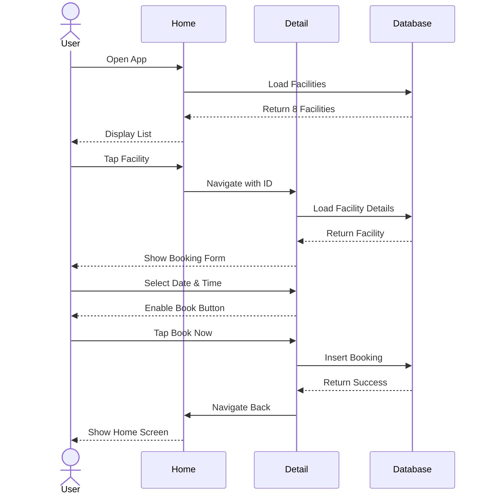

# 🎨 GameArena UI Flow - Visual Diagram Guide

**For creating actual diagrams in Figma, Adobe XD, or Draw.io**

---

## Quick Start: Import This into Draw.io

Visit: https://app.diagrams.net/
File → Import → Paste this content

---

## 1. Complete Application Flow Diagram

### Mermaid Diagram Code (Copy & Paste into Mermaid Live Editor)

Visit: https://mermaid.live/



---

## 2. Screen-by-Screen Flow Diagram

### Home Screen Flow



### Facility Detail Screen Flow



### Booking History Flow



---

## 3. User Journey Flow (Swimlane Diagram)

```
┌─────────────────────────────────────────────────────────────────────┐
│                         USER JOURNEY: BOOKING A FACILITY             │
└─────────────────────────────────────────────────────────────────────┘

USER ACTIONS              |  SCREEN DISPLAYED        |  SYSTEM RESPONSE
─────────────────────────────────────────────────────────────────────
                          |                          |
Opens App ───────────────→│  HOME SCREEN            │
                          │  - List of facilities   │──→ Load from DB
                          │  - Filter chips         │     8 facilities
                          │                          │
Taps "Cricket" filter ───→│  FILTERED VIEW          │
                          │  - 2 cricket grounds    │──→ Filter applied
                          │                          │
Taps "Cricket Ground A" ─→│  FACILITY DETAIL        │
                          │  - Facility info        │──→ Load facility
                          │  - Date selector        │     Generate dates
                          │  - Time slots (empty)   │
                          │                          │
Selects "Jan 27" date ───→│  DETAIL (Date Selected) │
                          │  - Date highlighted     │──→ Check bookings
                          │  - Time slots loaded    │     for that date
                          │  - Book button disabled │
                          │                          │
Taps "10:00" time slot ──→│  DETAIL (Time Selected) │
                          │  - Time slot blue       │──→ Calculate price
                          │  - Book button enabled  │     Show $50.00
                          │  - Shows "Book - $50"   │
                          │                          │
Taps "Book Now" button ──→│  BOOKING PROCESSING     │
                          │  - Loading indicator    │──→ Insert booking
                          │                          │     to database
                          │                          │     Generate ID
                          │  HOME SCREEN            │
                          │  - Returns after success│──→ Show success
                          │                          │
Taps "Bookings" tab ─────→│  BOOKING HISTORY        │
                          │  - Booking #1234        │──→ Load user's
                          │  - Status: Confirmed    │     bookings
                          │  - Cancel button shown  │
                          │                          │
Views booking details ────│  (Same screen)          │
Mission accomplished! ✓   │                          │
─────────────────────────────────────────────────────────────────────

TOTAL TIME: ~60-90 seconds
TOTAL SCREENS: 3 (Home → Detail → History)
TOTAL INTERACTIONS: 6 taps
```

---

## 4. Navigation Architecture

```
┌────────────────────────────────────────────────────────────┐
│                     NAVIGATION GRAPH                       │
│                                                            │
│  ┌──────────────────────────────────────────────────┐    │
│  │           Bottom Navigation Destinations          │    │
│  │                                                    │    │
│  │   ┌──────────────┐         ┌──────────────┐     │    │
│  │   │     HOME     │         │   BOOKINGS   │     │    │
│  │   │  (Start)     │◄───────►│   HISTORY    │     │    │
│  │   └──────┬───────┘         └──────────────┘     │    │
│  │          │                                        │    │
│  │          │ onFacilityClick(id)                   │    │
│  │          ↓                                        │    │
│  │   ┌──────────────┐                               │    │
│  │   │   FACILITY   │                               │    │
│  │   │    DETAIL    │                               │    │
│  │   │  (facilityId)│                               │    │
│  │   └──────┬───────┘                               │    │
│  │          │                                        │    │
│  │          │ onBackClick() OR bookingSuccess       │    │
│  │          ↓                                        │    │
│  │   ┌──────────────┐                               │    │
│  │   │     HOME     │                               │    │
│  │   │   (Return)   │                               │    │
│  │   └──────────────┘                               │    │
│  │                                                    │    │
│  └──────────────────────────────────────────────────┘    │
│                                                            │
│  Navigation Type:                                         │
│  • Bottom Nav: No stack, switch destinations              │
│  • Stack Nav: Push/Pop with back stack                    │
│  • Deep Link: gamearena://facility/{id}                   │
│                                                            │
└────────────────────────────────────────────────────────────┘
```

---

## 5. Component Hierarchy

```
MainActivity
│
└── GameArenaApp (Scaffold)
    │
    ├── TopAppBar
    │   ├── Title (Dynamic based on route)
    │   └── Navigation Icon (Back button when needed)
    │
    ├── Content (NavHost)
    │   │
    │   ├── HomeScreen
    │   │   ├── FilterChipRow
    │   │   │   ├── AllChip
    │   │   │   ├── CricketChip
    │   │   │   ├── PoolChip
    │   │   │   └── PickleballChip
    │   │   │
    │   │   └── FacilityList (LazyColumn)
    │   │       ├── FacilityCard (Item 1)
    │   │       ├── FacilityCard (Item 2)
    │   │       └── FacilityCard (Item n)
    │   │
    │   ├── FacilityDetailScreen
    │   │   ├── FacilityInfoCard
    │   │   │   ├── Icon
    │   │   │   ├── Name
    │   │   │   ├── Price
    │   │   │   └── Description
    │   │   │
    │   │   ├── DateSelector
    │   │   │   ├── SectionHeader ("Select Date")
    │   │   │   └── DateChipRow (Horizontal scroll)
    │   │   │       ├── DateChip (Today)
    │   │   │       ├── DateChip (Tomorrow)
    │   │   │       └── DateChip (+ 5 days)
    │   │   │
    │   │   ├── TimeSlotGrid
    │   │   │   ├── SectionHeader ("Available Time Slots")
    │   │   │   ├── Legend (Color meanings)
    │   │   │   └── LazyVerticalGrid (3 columns)
    │   │   │       ├── TimeSlotItem (06:00)
    │   │   │       ├── TimeSlotItem (07:00)
    │   │   │       └── TimeSlotItem (... 22:00)
    │   │   │
    │   │   └── BookButton
    │   │       └── "Book Now - $XX.XX"
    │   │
    │   └── BookingHistoryScreen
    │       └── BookingList (LazyColumn) OR EmptyState
    │           ├── BookingCard (Item 1)
    │           │   ├── BookingHeader
    │           │   │   ├── Booking ID
    │           │   │   └── Status Badge
    │           │   ├── FacilityName
    │           │   ├── DateRow (Icon + Text)
    │           │   ├── TimeRow (Icon + Text)
    │           │   ├── PriceRow (Icon + Text)
    │           │   └── CancelButton (if applicable)
    │           │
    │           └── BookingCard (Item n)
    │
    └── BottomNavigationBar
        ├── HomeNavigationItem
        └── BookingsNavigationItem
```

---

## 6. Data Flow Diagram

```
┌────────────────────────────────────────────────────────────┐
│                    DATA FLOW ARCHITECTURE                   │
└────────────────────────────────────────────────────────────┘

┌──────────────┐
│     USER     │
│  INTERFACE   │
│   (Screen)   │
└──────┬───────┘
       │ User Action
       ↓
┌──────────────┐
│  VIEWMODEL   │  ← Holds UI State
│   (Logic)    │  ← Manages business logic
└──────┬───────┘
       │ Repository Call
       ↓
┌──────────────┐
│  REPOSITORY  │  ← Data abstraction layer
│  (Data Src)  │  ← Handles data operations
└──────┬───────┘
       │ DAO Call
       ↓
┌──────────────┐
│     DAO      │  ← Database Access Object
│ (Queries)    │  ← SQL operations
└──────┬───────┘
       │ Query Execution
       ↓
┌──────────────┐
│    ROOM      │  ← SQLite wrapper
│  DATABASE    │  ← Persistent storage
└──────────────┘


EXAMPLE: Creating a Booking
═══════════════════════════

User: Taps "Book Now"
      ↓
Screen: Calls onBookingConfirm()
      ↓
ViewModel: bookingViewModel.createBooking(userId)
      ↓
ViewModel: Validates data (date, time, facility)
      ↓
Repository: bookingRepository.createBooking(booking)
      ↓
DAO: bookingDao.insert(booking)
      ↓
Database: INSERT INTO bookings VALUES (...)
      ↓
DAO: Returns booking ID (Long)
      ↓
Repository: Returns Result<Booking>
      ↓
ViewModel: Updates UI state
      ↓
ViewModel: uiState.bookingSuccess = true
      ↓
Screen: Observes state change
      ↓
Screen: Navigates back to Home
      ↓
User: Sees updated home screen


EXAMPLE: Loading Facilities
════════════════════════════

App Launch
      ↓
MainActivity: Initializes database
      ↓
HomeScreen: Composable renders
      ↓
ViewModel: facilitiesViewModel.init()
      ↓
Repository: facilityRepository.getAllFacilities()
      ↓
DAO: facilityDao.getAll()
      ↓
Database: SELECT * FROM facilities
      ↓
DAO: Returns Flow<List<Facility>>
      ↓
Repository: Returns Flow<List<Facility>>
      ↓
ViewModel: Collects flow as State
      ↓
ViewModel: Updates uiState.facilities
      ↓
Screen: Observes state (collectAsState())
      ↓
Screen: Recomposes with data
      ↓
User: Sees facility list
```

---

## 7. State Management Flow

```
┌────────────────────────────────────────────────────────────┐
│                    UI STATE FLOW DIAGRAM                    │
└────────────────────────────────────────────────────────────┘

HomeScreen States:
─────────────────

    ┌─────────────┐
    │   LOADING   │
    │ (Initial)   │
    └──────┬──────┘
           │
           ↓
    ┌─────────────┐
    │   LOADED    │
    │ (Facilities │
    │  displayed) │
    └──────┬──────┘
           │
           ├─→ [Filter Applied] ──→ FILTERED VIEW
           │                             │
           │                             └─→ [Clear Filter] ──┐
           │                                                   ↓
           └───────────────────────────────────────────────────┘


FacilityDetailScreen States:
────────────────────────────

    ┌─────────────┐
    │   LOADING   │
    │  (Facility) │
    └──────┬──────┘
           │
           ↓
    ┌─────────────┐
    │  FACILITY   │
    │   LOADED    │
    │ (No date)   │
    └──────┬──────┘
           │
           ↓
    ┌─────────────┐
    │    DATE     │
    │  SELECTED   │
    │ (Time slots │
    │   loaded)   │
    └──────┬──────┘
           │
           ↓
    ┌─────────────┐
    │    TIME     │
    │  SELECTED   │
    │ (Button     │
    │  enabled)   │
    └──────┬──────┘
           │
           ↓
    ┌─────────────┐
    │  BOOKING    │
    │ PROCESSING  │
    └──────┬──────┘
           │
           ↓
    ┌─────────────┐
    │  BOOKING    │
    │  SUCCESS    │
    │ (Navigate)  │
    └─────────────┘


BookingHistoryScreen States:
─────────────────────────────

    ┌─────────────┐
    │   LOADING   │
    │  (Bookings) │
    └──────┬──────┘
           │
           ├─→ [No Bookings] ──→ EMPTY STATE
           │
           └─→ [Bookings Found] ──→ ┌─────────────┐
                                     │  BOOKINGS   │
                                     │  DISPLAYED  │
                                     └──────┬──────┘
                                            │
                                            ↓
                                     ┌─────────────┐
                                     │  CANCELLING │
                                     │  (Loading)  │
                                     └──────┬──────┘
                                            │
                                            ↓
                                     ┌─────────────┐
                                     │  CANCELLED  │
                                     │ (Refreshed) │
                                     └─────────────┘
```

---

## 8. Interaction Flow Matrix

```
┌─────────────────────────────────────────────────────────────┐
│              USER INTERACTION FLOW MATRIX                   │
└─────────────────────────────────────────────────────────────┘

FROM SCREEN       ACTION              TO SCREEN         RESULT
──────────────────────────────────────────────────────────────
HOME              Tap Facility Card   FACILITY DETAIL   Push stack
HOME              Tap Filter Chip     HOME              Filter applied
HOME              Tap Bookings Tab    BOOKING HISTORY   Switch tab

FACILITY DETAIL   Tap Back Button     HOME              Pop stack
FACILITY DETAIL   Select Date         FACILITY DETAIL   Load time slots
FACILITY DETAIL   Select Time         FACILITY DETAIL   Enable button
FACILITY DETAIL   Tap Book Now        HOME              Create booking

BOOKING HISTORY   Tap Home Tab        HOME              Switch tab
BOOKING HISTORY   Tap Cancel          BOOKING HISTORY   Update status

ANY SCREEN        System Back         PREVIOUS SCREEN   Pop stack
ANY SCREEN        Deep Link           TARGET SCREEN     Direct nav


┌─────────────────────────────────────────────────────────────┐
│                    BUTTON STATE MATRIX                      │
└─────────────────────────────────────────────────────────────┘

SCREEN             BUTTON            ENABLED WHEN       ACTION
──────────────────────────────────────────────────────────────
HOME               Filter Chip       Always             Filter list
HOME               Facility Card     Always             Navigate

FACILITY DETAIL    Back Button       Always             Pop stack
FACILITY DETAIL    Date Chip         Always             Load slots
FACILITY DETAIL    Time Slot (Avail) Date selected      Select time
FACILITY DETAIL    Time Slot (Booked) Never             No action
FACILITY DETAIL    Book Now          Date + Time set    Create booking

BOOKING HISTORY    Cancel Button     Future confirmed   Cancel booking
BOOKING HISTORY    Cancel Button     Past/Cancelled     Disabled
```

---

## 9. Error Handling Flow

```
┌────────────────────────────────────────────────────────────┐
│                   ERROR HANDLING FLOW                       │
└────────────────────────────────────────────────────────────┘

HOME SCREEN Errors:
─────────────────

Database Error
      │
      ├─→ Show error message
      └─→ Display retry button

No Facilities Found
      │
      ├─→ Show empty state
      └─→ "No facilities available"


FACILITY DETAIL Errors:
──────────────────────

Facility Not Found
      │
      ├─→ Show error message
      └─→ Navigate back to home

Booking Conflict (Time already booked)
      │
      ├─→ Show error snackbar
      ├─→ Refresh time slots
      └─→ Mark slot as unavailable

Network Error (if online booking)
      │
      ├─→ Show retry dialog
      └─→ Save to local queue


BOOKING HISTORY Errors:
──────────────────────

Load Failure
      │
      ├─→ Show error message
      └─→ Display retry button

Cancel Failure
      │
      ├─→ Show error snackbar
      └─→ Revert UI state


GENERAL Error Flow:
──────────────────

Error Occurs
      ↓
Try-Catch in ViewModel
      ↓
Update UI State with Error
      ↓
Screen Observes Error State
      ↓
Display Error UI
      ↓
Provide Retry Option
      ↓
User Taps Retry
      ↓
Retry Operation
      ↓
Success or Show Error Again
```

---

## 10. Animation & Transition Timing

```
┌────────────────────────────────────────────────────────────┐
│               ANIMATION TIMING DIAGRAM                      │
└────────────────────────────────────────────────────────────┘

Screen Transitions:
─────────────────

Home → Facility Detail
│
│  0ms    ─────────────────────── Start
│  50ms   ───────────── Fade out home
│  100ms  ────── Slide in detail (from right)
│  300ms  ─ Complete
│
└─→ Total: 300ms


Filter Selection:
───────────────

Filter Tap
│
│  0ms    ─────────────────────── Start
│  50ms   ───────── Scale chip 95%
│  100ms  ─── Scale back to 100%
│  150ms  ─ Color change complete
│  200ms  ─ List filter applied
│
└─→ Total: 200ms


Time Slot Selection:
──────────────────

Time Slot Tap
│
│  0ms    ─────────────────────── Start
│  50ms   ──────────── Ripple effect
│  100ms  ──── Color change (blue)
│  150ms  ── Button state update
│
└─→ Total: 150ms


Booking Success:
──────────────

Book Button Tap
│
│  0ms    ─────────────────────── Start
│  100ms  ────────── Loading indicator
│  500ms  ─── Database write (avg)
│  600ms  ── Success animation
│  900ms  ─ Navigate to home
│
└─→ Total: 900ms


Loading States:
─────────────

Initial Load
│
│  0ms    ─────────────────────── Start
│  300ms  ──────── Show skeleton UI
│  1000ms ─ Data loaded (avg)
│  1200ms ─ Fade in content
│
└─→ Total: 1200ms (varies with data)
```

---

## 11. Responsive Layout Guidelines

```
┌────────────────────────────────────────────────────────────┐
│              RESPONSIVE LAYOUT BREAKPOINTS                  │
└────────────────────────────────────────────────────────────┘

Phone (Portrait):
─────────────────
Width: 360 - 480dp
│
├─ Bottom Nav: Full width
├─ Facility Card: 1 column, full width
├─ Time Slot Grid: 3 columns
└─ Max content width: Match parent


Phone (Landscape):
─────────────────
Width: 640 - 900dp
│
├─ Bottom Nav: Full width
├─ Facility Card: 2 columns
├─ Time Slot Grid: 4 columns
└─ Max content width: 80% centered


Tablet (Portrait):
─────────────────
Width: 600 - 840dp
│
├─ Navigation Rail (left side, not bottom)
├─ Facility Card: 2 columns
├─ Time Slot Grid: 4 columns
└─ Max content width: 600dp centered


Tablet (Landscape):
──────────────────
Width: 900+dp
│
├─ Navigation Rail (left side)
├─ Facility Card: 3 columns
├─ Time Slot Grid: 6 columns
├─ Max content width: 840dp centered
└─ Two-pane layout for detail view


Layout Adaptations:
─────────────────

< 600dp (Phone):
    • Bottom navigation
    • Single column lists
    • Full-width cards
    • 3-column time grid

600 - 900dp (Small Tablet):
    • Navigation rail OR bottom nav
    • 2-column grid
    • Centered content (max 600dp)
    • 4-column time grid

> 900dp (Large Tablet/Foldable):
    • Navigation rail (permanent)
    • 2-pane layout (list + detail)
    • 3-column facility grid
    • 6-column time grid
    • Max 840dp content width
```

---

## 12. Accessibility Flow

```
┌────────────────────────────────────────────────────────────┐
│               ACCESSIBILITY NAVIGATION FLOW                 │
└────────────────────────────────────────────────────────────┘

Screen Reader Navigation Order:
───────────────────────────────

HOME SCREEN:
1. "GameArena, Heading"
2. "All facilities filter chip, selected"
3. "Cricket facilities filter chip, not selected"
4. "Pool facilities filter chip, not selected"
5. "Pickleball facilities filter chip, not selected"
6. "Cricket Ground A, $50 per hour, Professional cricket..."
7. "Cricket Ground B, $40 per hour, Standard cricket..."
8. [... more facilities ...]
9. "Home tab, selected"
10. "Bookings tab, not selected"


FACILITY DETAIL SCREEN:
1. "Back button"
2. "Cricket Ground A, Heading"
3. "Price: $50 per hour"
4. "Description: Professional cricket ground..."
5. "Select date, Heading"
6. "Today, January 26, not selected"
7. "Tomorrow, January 27, not selected"
8. [... more dates ...]
9. "Available time slots, Heading"
10. "6 AM, available, button"
11. "7 AM, available, button"
12. "8 AM, booked, disabled"
[... more time slots ...]
20. "Book now for $50, disabled"


BOOKING HISTORY SCREEN:
1. "My Bookings, Heading"
2. "Booking 1234, Confirmed"
3. "Cricket Ground A"
4. "Date: January 26, 2026"
5. "Time: 10 AM to 11 AM"
6. "Price: $50"
7. "Cancel booking, button"
8. [... more bookings ...]
9. "Home tab, not selected"
10. "Bookings tab, selected"


Focus Order Rules:
────────────────
1. Top to bottom
2. Left to right
3. Logical reading order
4. Skip decorative elements
5. Group related items


TalkBack Announcements:
──────────────────────

Filter Applied:
"Showing cricket facilities only, 2 results"

Booking Created:
"Booking confirmed for Cricket Ground A on January 26 at 10 AM"

Booking Cancelled:
"Booking cancelled successfully"

Error Occurred:
"Error: Unable to complete booking. Please try again"


Keyboard Navigation:
──────────────────

Tab:      Next focusable element
Shift+Tab: Previous focusable element
Enter:    Activate button/chip
Space:    Activate button/chip
Arrow keys: Navigate within grid/list
Escape:   Close dialog/go back
```

---

## 13. Design Tokens Reference

```yaml
# Design Tokens for GameArena App
# Use these values consistently across all wireframes

spacing:
  xs: 4dp
  sm: 8dp
  md: 12dp
  lg: 16dp
  xl: 24dp
  xxl: 32dp

corner_radius:
  small: 8dp
  medium: 12dp
  large: 16dp
  chip: 16dp
  full: 9999dp

elevation:
  level0: 0dp      # Surface
  level1: 1dp      # Slightly raised
  level2: 2dp      # Card
  level3: 3dp      # Nav bar
  level4: 4dp      # Raised card
  level5: 8dp      # Modal

typography_size:
  display_large: 57sp
  display_medium: 45sp
  display_small: 36sp
  headline_large: 32sp
  headline_medium: 28sp
  headline_small: 24sp
  title_large: 22sp
  title_medium: 16sp
  title_small: 14sp
  body_large: 16sp
  body_medium: 14sp
  body_small: 12sp
  label_large: 14sp
  label_medium: 12sp
  label_small: 11sp

icon_size:
  small: 18dp
  medium: 24dp
  large: 48dp
  xlarge: 64dp

touch_target:
  minimum: 48dp
  recommended: 56dp

component_height:
  app_bar: 64dp
  bottom_nav: 80dp
  button: 48dp
  chip: 32dp
  card_min: 120dp
  time_slot: 48dp

animation_duration:
  fast: 100ms
  medium: 200ms
  slow: 300ms
  loading: 500ms

colors:
  # Material 3 Dynamic Color
  primary: "#6750A4"
  on_primary: "#FFFFFF"
  primary_container: "#EADDFF"
  on_primary_container: "#21005D"
  
  secondary: "#625B71"
  on_secondary: "#FFFFFF"
  secondary_container: "#E8DEF8"
  on_secondary_container: "#1D192B"
  
  tertiary: "#7D5260"
  on_tertiary: "#FFFFFF"
  tertiary_container: "#FFD8E4"
  on_tertiary_container: "#31111D"
  
  error: "#B3261E"
  on_error: "#FFFFFF"
  error_container: "#F9DEDC"
  on_error_container: "#410E0B"
  
  background: "#FFFBFE"
  on_background: "#1C1B1F"
  
  surface: "#FFFBFE"
  on_surface: "#1C1B1F"
  surface_variant: "#E7E0EC"
  on_surface_variant: "#49454F"
  
  outline: "#79747E"
  outline_variant: "#CAC4D0"
  
  # Custom status colors
  success: "#4CAF50"
  warning: "#FF9800"
  info: "#2196F3"
```

---

## 14. Export Instructions for Figma/Adobe XD

### Step-by-Step Guide to Create Wireframes:

#### Option 1: Figma (Recommended - Free)

1. **Create Account**: Go to https://figma.com
2. **Create New Design File**: Click "New design file"
3. **Set Frame Size**: 
   - Press 'F' for Frame tool
   - Choose "Android" → "Phone"
   - Create 3 frames (360x800dp each)
4. **Add Components**:
   - Use Rectangle tool (R) for cards/containers
   - Use Text tool (T) for labels
   - Use Material Design icon plugin
5. **Create Wireframes**:
   - Frame 1: Home Screen
   - Frame 2: Facility Detail Screen
   - Frame 3: Booking History Screen
6. **Add Connections**:
   - Select element
   - Click "+" next to Prototype
   - Draw arrow to target frame
   - Set interaction type
7. **Export**:
   - File → Export
   - Choose PDF or PNG
   - Include all frames

#### Option 2: Draw.io (Free, Simple)

1. **Open**: Go to https://app.diagrams.net
2. **Import Mermaid**: Copy mermaid code from above
3. **Or Create Manually**:
   - Use Android mockup template
   - Drag and drop shapes
   - Add text labels
4. **Create Flow Diagram**:
   - Use flowchart shapes
   - Connect with arrows
   - Add decision points
5. **Export**: File → Export as → PDF/PNG

#### Option 3: Paper & Pen (Traditional)

1. **Draw 3 rectangles** (phone screens)
2. **Sketch components** inside each
3. **Add labels** for all elements
4. **Draw arrows** showing navigation
5. **Scan or photograph** your drawings
6. **Annotate digitally** if needed

---

## 15. Deliverable Checklist

### Files to Submit:

- [ ] **Wireframes PDF/PNG**
  - Home Screen wireframe
  - Facility Detail Screen wireframe
  - Booking History Screen wireframe
  - Empty state wireframe (bonus)

- [ ] **Navigation Flow Diagram**
  - Complete flow between all screens
  - User actions labeled
  - State transitions shown

- [ ] **Component Specifications Document**
  - Dimensions table
  - Spacing system
  - Typography scale
  - Color palette

- [ ] **User Journey Map**
  - At least 1 complete user flow
  - Step-by-step with screenshots
  - Expected time per step

- [ ] **Written Documentation**
  - Design rationale (why these layouts?)
  - Accessibility considerations
  - Future enhancements

### Quality Checklist:

- [ ] All screens are properly labeled
- [ ] Navigation paths are clear
- [ ] Component sizes are specified
- [ ] Interaction states are shown
- [ ] Error states are documented
- [ ] Empty states are included
- [ ] Loading states are shown
- [ ] Accessibility is addressed
- [ ] Responsive considerations noted

---

## 16. Lab Submission Template

```markdown
# GameArena Wireframes & UI Flow - Lab Submission

**Student Name**: [Your Name]
**Date**: January 26, 2026
**Course**: Mobile Application Development
**Lab**: Wireframes & UI Navigation Flow

---

## 1. Introduction

GameArena is a sports facility booking application that allows users to...

[Brief description of the app and its purpose]

---

## 2. Wireframes

### 2.1 Home Screen
[Insert wireframe image here]

**Description**: The home screen displays...
**Components**:
- Top App Bar (64dp height)
- Filter chips row
- Facility list (LazyColumn)
- Bottom navigation bar

### 2.2 Facility Detail Screen
[Insert wireframe image here]

**Description**: The detail screen allows users to...
**Components**:
- Facility info card
- Date selector
- Time slot grid
- Book button

### 2.3 Booking History Screen
[Insert wireframe image here]

**Description**: This screen shows all user bookings...
**Components**:
- Booking cards
- Status badges
- Cancel buttons

---

## 3. UI Navigation Flow

[Insert navigation diagram here]

**Flow Description**:
1. User starts at Home Screen
2. Taps facility card → navigates to Detail Screen
3. Selects date and time
4. Confirms booking → returns to Home
5. Taps Bookings tab → views history

---

## 4. User Journey

**Primary Journey: Booking a Cricket Ground**

1. User opens app
2. Filters by "Cricket"
3. Selects "Cricket Ground A"
4. Chooses tomorrow's date
5. Picks 10 AM time slot
6. Confirms booking
7. Views booking in history

**Time**: 60-90 seconds
**Screens**: 3
**Interactions**: 6

---

## 5. Design Rationale

### Why This Layout?

**Home Screen**: 
- Filter chips at top for quick access
- Card layout for easy scanning
- Bottom nav for persistent navigation

**Detail Screen**:
- Large facility info card for clarity
- Horizontal date scroll for 7-day view
- Grid layout for time slots (3 columns fits phone)
- Fixed bottom button for easy booking

**History Screen**:
- Card-based layout for readability
- Clear status indicators
- Action buttons per booking

---

## 6. Accessibility Considerations

- All touch targets are 48dp minimum
- Text contrast ratio meets WCAG AA (4.5:1)
- Screen reader support with content descriptions
- Keyboard navigation supported
- Focus indicators visible

---

## 7. Future Enhancements

- Search functionality
- Facility ratings and reviews
- Payment integration
- Push notifications for reminders
- Dark mode support

---

## 8. Conclusion

These wireframes provide a solid foundation for the GameArena app development. The navigation flow is intuitive, the layout is user-friendly, and accessibility has been considered throughout.

---

## Appendix: Tools Used

- **Wireframe Tool**: [Figma/Adobe XD/Draw.io/Paper]
- **Diagram Tool**: [Mermaid/Draw.io/Lucidchart]
- **Documentation**: Markdown

```

---

## 17. Mermaid Live Editor Links

**Create these diagrams online:**

### Main Navigation Flow
```
https://mermaid.live/
```
Paste the mermaid code from Section 1

### State Diagrams
```
https://mermaid.live/
```
Paste the state diagram code from Section 2

### Sequence Diagrams (Optional)


---

## 18. Quick Reference Card

```
┌────────────────────────────────────────┐
│    GAMEARENA WIREFRAME QUICK REF       │
└────────────────────────────────────────┘

SCREENS:          3 main
NAVIGATION:       Bottom Nav + Stack
DATABASE:         Room (SQLite)
ARCHITECTURE:     MVVM

PRIMARY FLOWS:
1. Browse → Detail → Book
2. Browse → History → Cancel
3. Detail → Back → Browse

KEY COMPONENTS:
• Top Bar:         64dp
• Bottom Nav:      80dp
• Filter Chip:     32dp height
• Facility Card:   120dp min
• Time Slot:       48dp height
• Button:          48dp height

TOUCH TARGETS:    48dp minimum
TEXT CONTRAST:    4.5:1 ratio
ANIMATION:        100-300ms

COLOR SCHEME:     Material 3
PRIMARY:          #6750A4
BACKGROUND:       #FFFBFE
SUCCESS:          #4CAF50

SPACING SCALE:
xs(4)  sm(8)  md(12)  lg(16)  xl(24)

BREAKPOINTS:
Phone:     < 600dp
Tablet:    600-900dp
Desktop:   > 900dp
```

---

**END OF UI FLOW DOCUMENTATION**

**Need Help?**
- Figma tutorials: https://help.figma.com
- Material Design 3: https://m3.material.io
- Mermaid docs: https://mermaid.js.org

**Good luck with your lab!** 🎨📱
